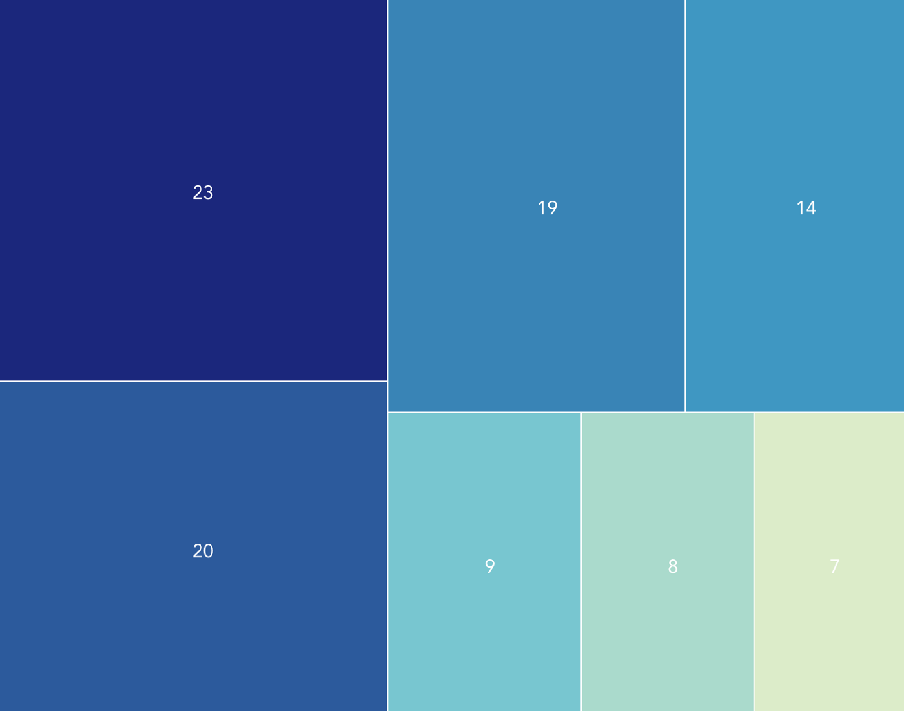

# Treemap squarify
Treemap squarify is calculating coordinates of a treemap representation following the "squarify" algorithm.

# Install

With npm
```
npm install treemap-squarify
```
Or in the browser
```
<script type="text/javascript" src="https://unpkg.com/treemap-squarify@1.0.1/lib/bundle.min.js"></script>
```

# Usage

With npm
```
const { getTreemap } = require('treemap-squarify');

const result = getTreemap({
  data: [ // your dataset
    { value: 10 },
    { value: 7 },
    { value: 4 },
    { value: 1 },
    { value: 5 },
    { value: 9 },
   ],
  width: 700, // the width and height of your treemap
  height: 600,
});
```

In the browser
```
<script type="text/javascript" src="https://unpkg.com/treemap-squarify@1.0.1/lib/bundle.min.js"></script>
<script type="text/javascript">
const result = Treemap.getTreemap({
  data: [ // your dataset
    { value: 10 },
    { value: 7 },
    { value: 4 },
    { value: 1 },
    { value: 5 },
    { value: 9 },
  ],
  width: 700, // the width and height of your treemap
  height: 600,
});
</script>
```

# Features

You can pass along properties with the data, they will be in the response object. For example a specific color for each data point:

```
const { getTreemap } = require('treemap-squarify');

const result = getTreemap({
  data: [
    { value: 10, color: 'red' },
    { value: 7, color: 'black' },
    { value: 4, color: 'blue' },
    { value: 1, color: 'white' },
    { value: 5, color: 'green' },
    { value: 9, color: 'grey' },
   ],
  width: 700,
  height: 600,
});
```

Result will be 
```
[
    {
      x: 0,
      y: 0,
      width: 330.56,
      height: 352.94,
      data: { value: 10, color: 'red' },
    },
    {
      x: 0,
      y: 352.94,
      width: 330.56,
      height: 247.06,
      data: { value: 7, color: 'black' },
    },
    {
      x: 330.56,
      y: 0,
      width: 295.56,
      height: 157.89,
      data: { value: 4, color: 'blue' },
    },
    {
      x: 626.11,
      y: 0,
      width: 73.89,
      height: 157.89,
      data: { value: 1, color: 'white' },
    },
    {
      x: 330.56,
      y: 157.89,
      width: 369.44,
      height: 157.89,
      data: { value: 5, color: 'green' },
    },
    {
      x: 330.56,
      y: 315.79,
      width: 369.44,
      height: 284.21,
      data: { value: 9, color: 'grey' },
    },
]
```

All coordinates are rounded with 2 decimals.

# Example

Dataset: `[23, 20, 19, 14, 9, 8, 7]`

```
const { getTreemap } = require('treemap-squarify');

const result = getTreemap({
  data: [
    { value: 23, color: '#1B277C', label: '23' },
    { value: 20, color: '#2C5A9C', label: '20' },
    { value: 19, color: '#3984B6', label: '19' },
    { value: 14, color: '#3F97C2', label: '14' },
    { value: 9, color: '#78C6D0', label: '9' },
    { value: 8, color: '#AADACC', label: '8' },
    { value: 7, color: '#DCECC9', label: '7' },
   ],
  width: 700,
  height: 600,
});
```
And in vue.js, for example, you can use SVG to create the treemap:
```
<svg :width="treemapWidth" :height="treemapHeight">
  <g
    v-for="rectangle in result"
    :key="`${rectangle.x}:${rectangle.y}`"
    class="treemap__rectangle"
    :fill="rectangle.color"
  >
    <rect
      :x="rectangle.x"
      :y="rectangle.y"
      :width="rectangle.width"
      :height="rectangle.height"
    ></rect>
    <text
      :x=getXText(rectangle)
      :y=getYText(rectangle)
      fill="white"
    >
      {{ rectangle.label }}
    </text>
  </g>
  Sorry, your browser does not support inline SVG.
</svg>
```

The result will be:


# Licensing

The code in this project is licensed under MIT license.
